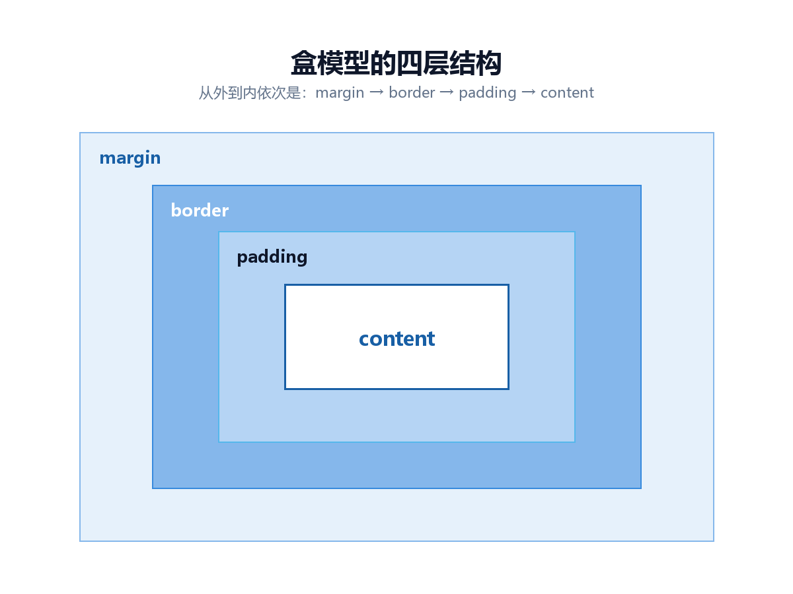

## 一切从盒模型开始

在 CSS 眼里，页面上的每个元素都是一个矩形盒子，由四层构成，从内到外依次是：

- **content**：内容本身占据的区域。
- **padding**：内边距，内容与边框之间的空隙。
- **border**：边框。
- **margin**：外边距，这个盒子与其他盒子之间的距离。



关键在于：**默认情况下 width 只表示 content 的宽度**，padding 和 border 会额外加在外面。所以写 `width: 100%` 再加一点内边距，元素就会撑破容器，甚至把页面顶出横向滚动条。

解决办法是全局改掉这个计算方式：

```css
* {
  box-sizing: border-box;
}
```

改成 `border-box` 之后，width 变成了从边框外沿量起的总宽度，内边距向内挤压内容而不是向外扩张。这一行几乎出现在所有现代项目里。

## 三种布局手段，各管一段

现代 CSS 里最常用的三种布局方式，职责划分其实很清楚：

- **普通文档流**：块级元素从上往下堆叠。这是默认行为，不用写任何代码。
- **Flexbox**：处理**一维**排列——一行或一列。适合导航栏、按钮组、居中。
- **Grid**：处理**二维**排列——既要管行又要管列。适合页面整体骨架、卡片列表。

## Flexbox：一维排列

本站的页眉就是把标题和导航放在一行的两端：

```css
.site-header .container {
  display: flex;
  align-items: center;
  justify-content: space-between;
}
```

只要给父元素加上 `display: flex`，它的直接子元素就自动成为弹性项目，默认在一行内排列。这比过去用 `float` 再清除浮动简单了太多。

## Grid：二维排列，还能自动响应

首页的文章列表是这样的：

```css
.post-list {
  display: grid;
  grid-template-columns: repeat(auto-fit, minmax(260px, 1fr));
  gap: 16px;
}
```

这一行 `grid-template-columns` 值得拆开看：

- `repeat(...)`：把列的定义重复若干次。
- `auto-fit`：让浏览器自己决定重复几次——容器放得下两列就两列，放不下就一列。
- `minmax(260px, 1fr)`：每列最小 260 像素，最大把剩余空间平分掉。

> 有意思的地方在于：这里一个 media query 都没写，但在手机上它自动就变成了单列。能用布局本身解决的问题，就不要用媒体查询硬编码断点。

## 那 media query 什么时候还需要

Grid 能自动调整的是列数，但有些事情它管不了，比如：窄屏时页眉要不要改成居中？头像和简介要不要从横排改成竖排？正文字号要不要调小一点？这些都得手动指定断点。

```css
@media (max-width: 600px) {
  .hero {
    flex-direction: column;
    align-items: flex-start;
  }
}
```

`max-width: 600px` 的意思是「视口宽度不超过 600 像素时生效」，也就是写给手机看的。

## 小结

盒模型决定了「一个盒子有多大」，Flex 解决「一行里怎么排」，Grid 解决「行列怎么摆」，媒体查询负责前两者管不到的显示差异。把这四件事分开想，布局就不会像一开始那么玄学了。
