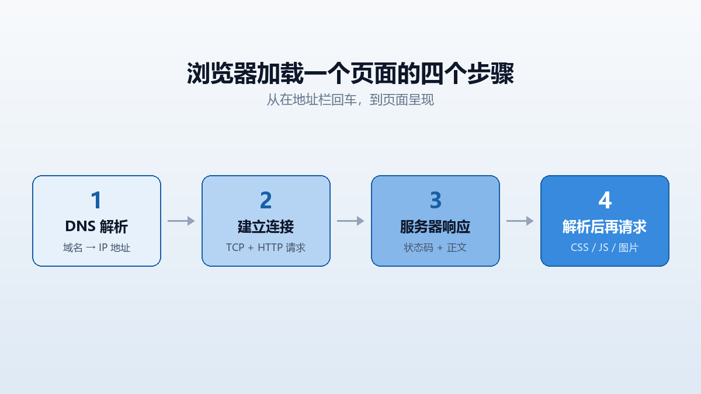

## 在地址栏按回车之后

当你在地址栏输入一个网址并回车，浏览器做的事大致是这样的：

1. 把域名（比如 `fa11leaf.github.io`）交给 DNS，查出一个 IP 地址——DNS 相当于互联网的电话簿。
2. 和那个 IP 建立 TCP 连接，然后按 HTTP 协议发出一个请求，大意是「请把某个路径下的内容给我」。
3. 服务器返回一个响应，里面包含状态码（200 表示成功，404 表示没找到）和内容正文。
4. 浏览器拿到正文，发现它是 `text/html` 类型，于是开始解析——并按照解析结果继续去请求 CSS、JS、图片等其他文件。

最后一步很重要：**HTML 文档本身只是骨架和清单**，它并不包含样式和图片的实体，只是告诉浏览器还要去哪里取。

## HTML 的角色：描述结构，不描述外观

HTML 的全称是 HyperText Markup Language，即超文本标记语言。它的职责只有一个：**标记出内容的结构和含义**——哪部分是标题、哪部分是段落、哪部分是导航。

至于标题应该多大、什么颜色，那不是 HTML 的事，是 CSS 的事。

## 一个标签由哪几部分组成

以 `<a href="目标地址">链接文字</a>` 为例：`a` 是标签名，来自 anchor（锚点）；`href` 是属性名；引号里的是属性值；标签之间的文字是内容。

有些标签没有内容和结束标签，称为空元素，例如 ``、` `、`<meta>`。

## 为什么语义化标签值得多打几个字母

`<header>`、`<nav>`、`<main>`、`<article>`、`<footer>` 这些标签，和 `
` 在默认外观上几乎没有区别。那为什么还要用它们？

- **可访问性**：读屏软件可以据此提供「跳到主内容」「跳到导航」这类快捷操作。
- **可维护性**：半年后回看代码，一眼就知道哪块是什么。
- **搜索引擎**：虽然权重不高，但结构清晰总比一堆无名 div 好。

> 一个简单的判断标准：能用语义标签表达清楚的地方，就不要用 div。div 是实在没有合适标签时的兜底选择。

## 本站现在的 HTML 结构

页眉、导航、页脚曾经写在每一个 HTML 文件里，改一次导航要开四个文件。

现在它们只存在于一个布局文件（`src/layouts/BaseLayout.astro`）里，四个页面都从那里继承。这是本阶段最大的变化：**重复的东西被抽走了**。

至于你正在读的这个页面——它在构建时就已经是一份完整的 HTML 了。浏览器拿到它，不需要执行任何脚本来「把内容变出来」。
